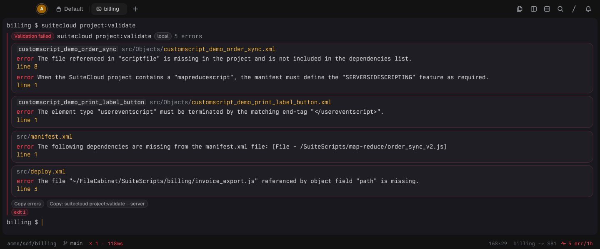
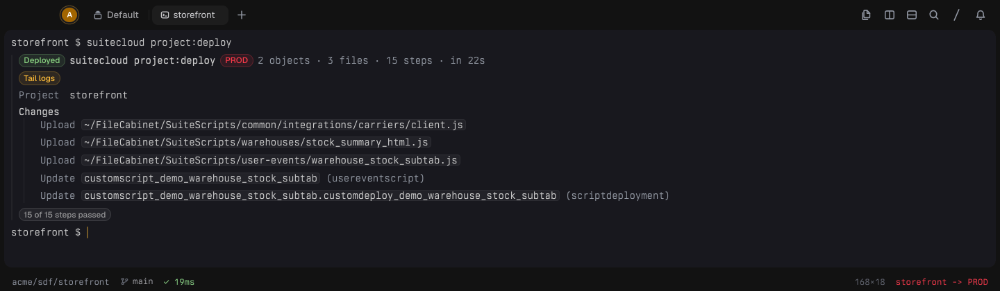
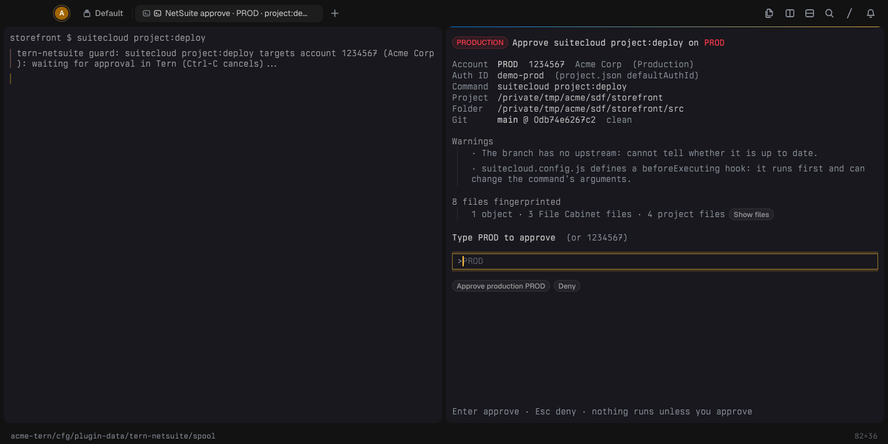
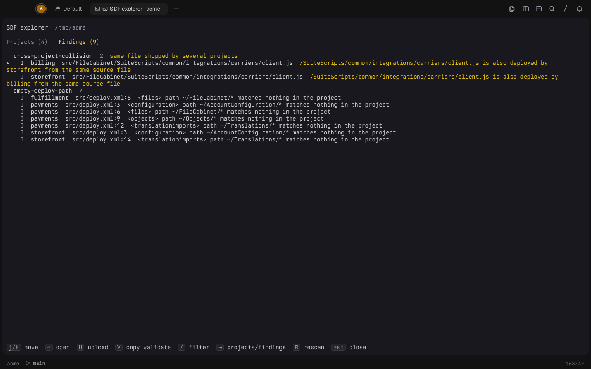
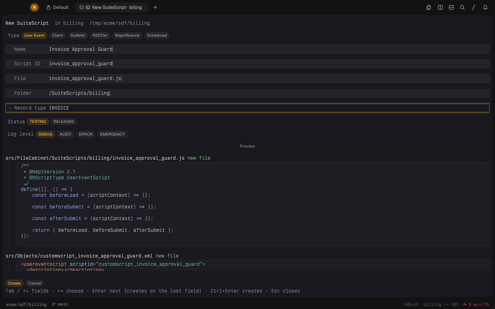
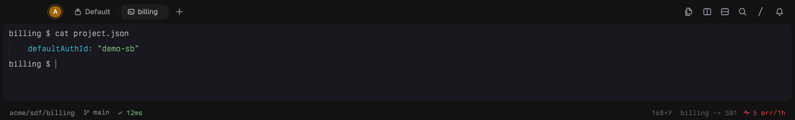
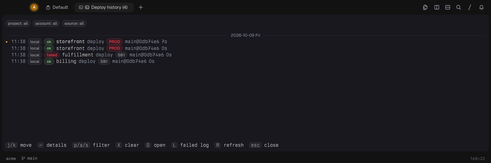
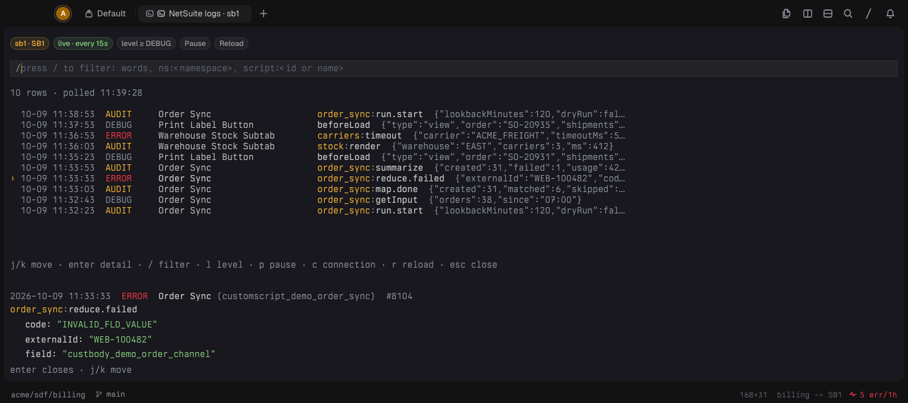
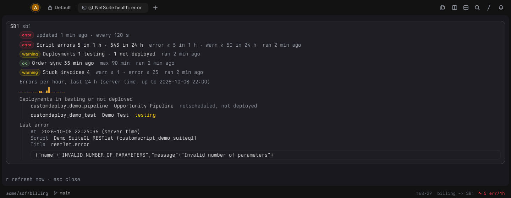

# tern-netsuite

NetSuite for [Tern](https://stencil.so/tern): native views for the SuiteCloud SDF CLI,
a production deploy guard, account status, an SDF project explorer, and
read-only SuiteQL monitoring (execution logs, account health).



Status: 0.1.0, public beta. Built and tested against SuiteCloud CLI 3.2.0 and
Tern 0.6.3 / 0.7.0.

## Install

```sh
git clone https://github.com/contrafy/tern-netsuite
tern plugin link "$PWD/tern-netsuite"   # or: tern plugin install github.com/contrafy/tern-netsuite
```

Everything in the "SDF CLI" section works with no NetSuite credentials. The
"Account monitoring" features need a connection (see below).

## SDF CLI

- **SuiteCloud lens.** `suitecloud project:validate | project:deploy |
  file:upload | project:package | project:adddependencies |
  account:manageauth --list/--info | object:list | file:list` render
  natively once they finish (also through `npx suitecloud` and
  `npx @oracle/suitecloud-cli`): an outcome badge, the target account (a
  red PRODUCTION badge for production, never guessed when the CLI does not
  print it), errors grouped by object with links to the file and line,
  collapsed warnings, and chips that copy the errors or a
  `project:validate --server` command. After a deploy, a chip opens the
  execution logs for the deployed scripts. Interactive (`-i`) and `--help`
  runs stay raw; Raw always shows the original output.
  For a wrapper such as `npm run validate`, add it to `lens.wrappers` in
  the config, run `scripts/tern-netsuite-wrappers` (`--check` reports drift)
  and `tern plugin reload`.

  

- **Account indicator.** Inside an SDF project the status line shows which
  account `project.json`'s `defaultAuthId` deploys to:
  `billing -> SB1` (muted), `... PROD` (red) for production,
  `<authId>? (unverified)` (warning) while it cannot be resolved. Click it for
  the Doctor.
- **Doctor** (`Tern NetSuite: Doctor`): CLI and Java versions, config
  diagnostics, auth IDs known to the CLI vs. the config, production accounts.
- **Production deploy guard** (opt-in shell integration):
  `project:deploy` and `file:upload` against a production or unknown
  account wait for an approval block that shows the account, command, git
  state and fingerprinted files, with typed confirmation. Sandbox targets
  run immediately. Install and limitations: [shell/README.md](shell/README.md).

  

- **SDF explorer** (`Tern NetSuite: SDF explorer`): every project in the
  repository with its target account, objects, deployments, File Cabinet
  tree, manifest dependencies and deploy.xml paths, plus findings: missing
  manifest dependencies, missing script files, objects or files not covered
  by deploy.xml, deploy paths that match nothing, and the same object or
  File Cabinet path shipped by two projects.

  

- **Upload this file** (`Tern NetSuite: Upload this file`): finds the
  project(s) that carry the focused file (following symlinks into shared
  source folders) and runs `suitecloud file:upload` for it in a split,
  always through the guard.
- **Account browser** (`Tern NetSuite: Browse account objects`): the
  account's custom objects and files compared with the project (account
  only / both / local only); `i` imports one into the project in a split.
  Imports refuse to overwrite uncommitted local changes unless forced with
  `I`.
- **New script** (`Tern NetSuite: New script`): a form that writes a
  SuiteScript 2.1 file, its script object and deployment, and the
  deploy.xml / manifest.xml edits the project needs, with a live preview.
  Optional templates: `scaffold.templates_dir` with `<type>.js` files using
  `{{scriptId}}` and `{{name}}`.

  

- **Deploy history** (`Tern NetSuite: Deploy history`): local deploys and
  uploads (recorded when the command finishes), guard decisions, and, with
  `history.ci.workflow` set, the repository's CI deploy runs from `gh` on one
  timeline; the status line adds the branch's latest CI deploy state.

| Status line | Deploy history |
| --- | --- |
|  |  |

The SuiteCloud CLI reads `project.json` and `suitecloud.config.js` from the
current directory only, and refreshes OAuth tokens on every account command.
Running two account commands for the same auth ID at the same time can
invalidate its token and force a browser re-login; the plugin runs its own
CLI calls one at a time.

## Account monitoring

Monitoring reads NetSuite with SuiteQL `SELECT`s only.

1. Add an account and a connection to the config (see the example).
   `transport` is `rest` (SuiteQL REST web services) or `restlet` (your own
   RESTlet, with `restlet.script`, `deploy` and the request/response field
   mapping). `auth` is `tba` (token-based) or `oauth2_m2m` (client
   credentials, PS256).
2. `Tern NetSuite: Connect account` stores the keys in the system keychain
   (`<connection-id>.<field>`), never in files or URLs, and runs
   `SELECT 1 AS ok FROM DUAL`.

Then:

- **Execution logs** (`Tern NetSuite: Execution logs`): a live tail of
  script execution logs (`scriptnote`) with level, script, text and
  `namespace:` filters; JSON details expand as trees
  (`monitor.log_title_json`).

  

- **Account health** (`Tern NetSuite: Account health`): script errors in
  the last hour and day with a 24 h chart, deployments in testing or not
  deployed, the last error, and your own `monitor.checks` (`count` with
  `warn_at` / `error_at`, `freshness` with `max_age_minutes`). One Tern
  window polls (`monitor.poll_seconds`); a red status-line badge and a toast
  appear when a connection goes into error. Built-in error thresholds:
  `monitor.script_errors`.

  

Queries run in the Tern window half (the keychain is only available
there), so a Tern window must be open. Read-only connections
(`read_only`, the default) refuse anything but a single `SELECT`/`WITH`.

## Configuration

`$XDG_CONFIG_HOME/tern-netsuite/config.json` (default
`~/.config/tern-netsuite/config.json`; palette: `Tern NetSuite: Open
config`). Every key is optional; a bad value falls back to its default
with a diagnostic (shown by the Doctor), unknown keys are reported, and
edits apply without a reload.
[`examples/config.json`](examples/config.json) shows
every section with the values of an example setup (placeholder account ids).

| Section | Keys |
| --- | --- |
| `general` | `native_default`, `max_lines`, `max_capture_bytes` |
| `suitecloud` | `program`, `timeout_ms` |
| `lens` | `wrappers: [{prefix, command}]` |
| `projects` | `roots`, `follow_symlinks`, `max_files` |
| `accounts` | `[{id, account_id, label?, production?, auth_ids}]` |
| `guard` | `confirm_production`, `typed_confirmation`, `commands`, `timeout_s` |
| `connections` | `[{id, account, auth, transport, read_only, timeout_ms, restlet?}]` |
| `monitor` | `poll_seconds`, `log_poll_seconds`, `log_title_json`, `script_errors`, `checks` |
| `status` | `enabled` |
| `scaffold` | `templates_dir` |
| `history` | `max_entries`, `ci: {workflow, gh, limit, timeout_ms, poll_seconds}` |

Safety defaults fail closed: an account id the plugin cannot classify
counts as production (non-production: `_SB<n>`, `_RP[<n>]`, `TSTDRV<n>`, or
`production: false`); a malformed `production` value counts as `true`; a typo
in `guard.commands` never unguards a default command; connections are
read-only.

## Development

```sh
make bootstrap   # pinned luau, luau-lsp, stylua, selene and Tern types into .tools/
make check       # format check, lint, typecheck, unit specs, shell suites, stub smoke
make smoke-real  # local only: load the checkout in an isolated real Tern under /tmp
```

- `plugin/lib/**` is pure Luau (no `tern` global), unit tested under the
  standalone `luau` binary (`make test FILTER=<substring>`). Fixtures under
  `tests/fixtures/` (real CLI captures, sanitized) are embedded by
  `make fixtures`.
- `plugin/*_host.luau` (daemon half: lenses, blocks, host hooks) and
  `plugin/*_window.luau` (window half: palette, status line, link routes,
  keychain, HTTP) are thin adapters wired by `plugin/host.luau` and
  `plugin/window.luau`. Every `tern-netsuite://` link is claimed by the
  window.
- `make smoke` loads both plugin halves against a strict stub `tern` (an
  unknown API or one used in the wrong half fails) and requires the
  manifest's lenses and blocks to be defined. CI runs `make check` on macOS
  arm64 and Linux x86_64.
- `scripts/screenshots.sh` rebuilds the screenshots above from a synthetic
  workspace in a sandboxed Tern with a fake SuiteCloud CLI (no NetSuite
  access).

See [CONTRIBUTING.md](CONTRIBUTING.md) and [SECURITY.md](SECURITY.md).

## License

MIT
